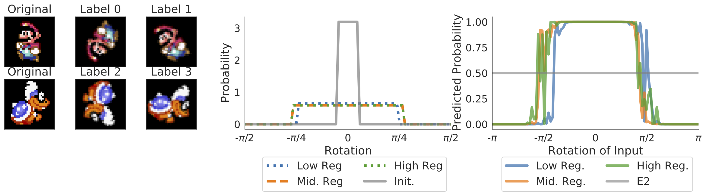

# Augerino


This repo contains the code to replicate the experiments in **Learning Invariances in Neural Networks** by [Greg Benton](g-benton.github.io), [Marc Finzi](https://mfinzi.github.io/), [Pavel Izmailov](https://izmailovpavel.github.io/), and [Andrew Gordon Wilson](https://cims.nyu.edu/~andrewgw/).

## Introduction

In this paper we propose *Augerino* - a simple, flexible method for learning invariances in neural networks using training data alone. 

Augerino functions by learning a distribution over augmentations, . By applying random distributions  to inputs  and averaging over outputs, we can construct an invariant model,  from any standard network 


We learn distribution  by parameterizing a distribution over a large space of transformations, and training both the network and Augerino jointly with a regularized loss that biases solutions towards as wide distributions as possible. 


Please cite our work if you find it helpful in your work:
```
@article{benton2020learning,
  title={Learning Invariances in Neural Networks},
  author={Benton, Gregory and Finzi, Marc and Izmailov, Pavel and Wilson, Andrew Gordon},
  journal={arXiv preprint arXiv:2010.11882},
  year={2020}
}
```

To install the `augerino` package, which includes the relevant models and loss functions to produce the results presented in the paper run:
```
git clone https://github.com/g-benton/learning-invariances.git
pip install -e learning-invariances
```

# Experiments

Most experiments can be run by simply calling a training script in their respective folders in the `./experiments/` directory.

## RotMNIST

To train the models used in Section 4.1 of the paper navigate to `./experiments/rotmnist/` and run the following:
```bash
python runner.py --epochs=<training Epochs> \
                 --lr=<learning rate> \
                 --wd=<weight decay> \
                 --dir=<directory to save models> \
                 --ncopies=<number of test time augmentation samples> \
                 --batch_size=<batch size>
```

We also include an `e2_runner.py` file that will train the E2-steerable network displayed in Figure 2 of paper (Weiler and Cesa, 2019).

## Mario and Iggy



We leave the Mario and Iggy experiments of Section 4.2 as interactive notebooks, to train models on this dataset should only take a few minutes on a GPU.
The training loops for multiple levels of regularization are located in `./experiments/mario-iggy/mario_trainer.ipynb`.
Likewise, the code to produce the plots of augmentation gradients and loss similar to those in Section 5 is located in `./experiments/mario-iggy/Mario_rotation_width.ipynb`.

The files and scripts needed to construct this dataset are included in `./experiments/mario-iggy/data/`. Additionally, we include an `e2_runner.py` file that will train the E2-steerable network displayed in Figure 3 of paper.

## Olivetti Faces

To train the Augerino models as shown in Section 4.3 of the paper navigate to `./experiments/olivetti` and run the following with the appropriate choice of `--aug_reg`:

```bash
python runner.py --epochs=<training Epochs> \
                 --lr=<learning rate> \
                 --wd=<weight decay> \
                 --dir=<directory to save models> \
                 --batch_size=<batch size>
```

Similar to the other experiments, the code to train the E2-steerable model in Figure 4 of the paper is found in `./e2_runner.py`.

## CIFAR10 

The script to train Augerino on CIFAR10 is located in `./experiments/cifar10/`. For this experiment you have the option to include standard data augmentation (`--transform=fixed`) or not (`--transform=none`) for the training set. 

The model can be trained by running 

```bash
python train_augerino.py --epochs=<training Epochs> \
                 --lr=<learning rate> \
                 --wd=<weight decay> \
                 --transform=<none or fixed training data augmentation> \
                 --dir=<directory to save models> \
                 --data_dir=<location of CIFAR10 dataset> \
                 --ncopies=<number of test time augmentation samples> \
                 --batch_size=<batch size>
```

## QM9

The scripts to train Augerino and the baselines on QM9 are located in `./experiments/qm9/`
To run all of the QM9 experiments in the paper and summarize the results in a dataframe, run 
```bash
python trainqm9_all.py
```
which will automatically parallelize to multiple gpus if they are visible from `CUDA_VISIBLE_DEVICES`.
To run just a single augerino model, use
```bash
python trainqm9.py --task=TASK --group=GROUP --augerino=True --aug=True
```
where we report results on TASK='homo' and TASK='lumo' and group='Trivial(3)' or group='T(3)' for no equivariance and translation equivariance respectively. To test the no augmentation baseline, run with flags `--augerino=False --aug=False` and to test the handcrafted SE(3) augmentation baseline run with `--augerino=False --aug=True`.

## Effective Dimension

To explore how Augerino effects effective dimensionality we use code from Google's Spectral Density library (`https://github.com/google/spectral-density`) to compute eigenvalues of the Hessian of the loss (Maddox et al. 2020). In the `./experiments/eff-dim/` directory there is a `test_reg_par.py` script that can be used to train Augerino on CIFAR10, as well as a bash script `runner.sh` that will train multiple models for a number of regularization levels.

The `compute_eigs.py` script can be used to compute the eigenvalues of the Hessian of the loss by passing in (i) a path to a trained model and (ii) a filename to save the eigenvalues. 

